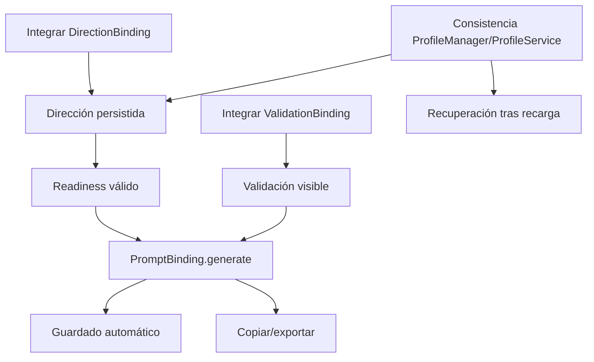

# Matriz de módulos de PortraitOS

Fecha: 2026-08-02

## Criterio de clasificación

- `OPERATIONAL`: cargado, inicializado, conectado y validado con evidencia funcional suficiente.
- `IMPLEMENTED_NOT_INTEGRATED`: implementación sustancial sin entrada/UI/inicialización efectiva.
- `PARTIAL`: parte del contrato existe o arranca, pero faltan capacidades, integración o prueba E2E.
- `SCAFFOLD_ONLY`: estructura sin comportamiento sustancial.
- `BROKEN`: fallo confirmado que impide el comportamiento previsto.
- `OBSOLETE`: sustituido y sin consumo, con evidencia.
- `UNKNOWN`: evidencia insuficiente.

La ausencia de pruebas y del recorrido E2E impide clasificar como `OPERATIONAL` dominios completos. Los CSS base son la única excepción técnica de bajo riesgo, documentada en el inventario del informe principal.

## Matriz completa

| Módulo | Archivos | Estado | Integración | Persistencia | Pruebas | Bloqueos | Evidencias |
|---|---|---|---|---|---|---|---|
| Entrada/bootstrap | `app/index.html` | PARTIAL | Carga 37 scripts e inicializa 9 componentes | indirecta | Chrome smoke PASS | 3 bindings omitidos | scripts `:2430-2473`; bootstrap `:2477-2515`; DOM `data-portraitos-ready=true` |
| Estilos | `app/css/*.css` | PARTIAL | 6 hojas cargadas desde HTML | N/A | render inicial PASS; responsive NOT TESTED | sin regresión visual | links `index.html:23-49`; `app.css` 44.645 bytes |
| Storage base | `app/js/storage.js` | PARTIAL | API global, no fachada única | `portraitos.profile.v1` + settings | estática | solapa con ProfileManager | `STORAGE_KEY` `:14`; export global `:1398` |
| Router | `app/js/router.js` | IMPLEMENTED_NOT_INTEGRATED | cargado, no iniciado; rutas distintas | hash URL | estática | dualidad con Wizard | `ROUTES` `:14-116`; export `:880`; sin `start()` en bootstrap |
| Wizard | `app/js/wizard.js` | PARTIAL | iniciado por `UI.init()` | `portraitos.wizard` | smoke inicial | usa PromptEngine paralelo | pasos `:22-63`; init `:69-98`; prompt `:713` |
| UI | `app/js/ui.js` | PARTIAL | bootstrap; coordina Wizard y bindings | indirecta | smoke inicial | depende de integración incompleta | `UI.init` `:103-135`; generate `:413-469`; export profile `:550` |
| Bus de eventos | `app/js/utils/events.js` | PARTIAL | consumido por servicios/bindings | no | estática | mezcla eventos AppEvents y window | export `:692`; múltiples `emit/on` |
| Utilidades | `constants.js`, `helpers.js`, `validators.js` | PARTIAL | globals cargados antes de servicios | claves/constantes | sintaxis PASS | sin tests unitarios | exports `constants.js:780`, `helpers.js:444`, `validators.js:1217` |
| Profile Manager | `profile.manager.js`, `profile.manager.binding.js` | PARTIAL | cargado e inicializado; CRUD conectado | `portraitos.profiles.v1` | smoke crea perfil inicial | import no UI; sincronización por clon | manager `:9-111`; persist `:143`; binding actions `:25-48` |
| Profile core | `profile.service.js`, `profile.binding.js` | PARTIAL | cargado, formulario conectado | biblioteca al guardar; claves arbitrarias API | estática/smoke | repositorios superpuestos | ProfileService global `:1194`; `save/restore` `:844-940` |
| Import/export de perfil | `profile.importexport.js`, UI | PARTIAL | export vía `download-profile`; import solo API | archivo JSON | NOT TESTED | sin selector/import action | import API `:92-115`; UI download `ui.js:550`; búsqueda HTML sin import |
| Photos | `photo.*.js`, `profile.photos.js`, `photos.binding.js` | PARTIAL | binding cargado; input/drop/gallery presentes | Data URL dentro de perfil | NOT TESTED con archivo | cuota/privacidad localStorage | input `index.html:616`; listeners `photos.binding.js:217-252`; Data URL `profile.photos.js:62-126` |
| Identity | `profile.identity.js`, `identity.engine.js`, `identity.binding.js` | PARTIAL | formulario, validate/lock/unlock conectados | dentro de perfil | NOT TESTED E2E | requiere fotos/completitud | listeners `identity.binding.js:47-49`; engine export `identity.engine.js:690` |
| Creative Direction | `profile.direction.js`, `creative.engine.js`, `direction.binding.js` | BROKEN | service/engine cargados; binding no cargado | modelo dentro de perfil, pero controles no escriben | fallo de integración confirmado | 22 controles sin listener | campos `index.html:1212-1892`; binding omitido en scripts; init `direction.binding.js:963-1001` |
| Knowledge Packs | `knowledge.pack.service.js`, `knowledge.binding.js` | PARTIAL | cargado/iniciado; aplicado por PromptBinding | selección global y por perfil | smoke DOM | catálogo embebido; compatibilidad limitada | claves `service:9-10`; `apply` `:132-159`; pipeline `prompt.binding.js:398-417` |
| Validation service | `profile.validation.js` | PARTIAL | readiness consumido por PromptBinding/Wizard | derivada, no durable | estática | reglas duplicables | `getGenerationReadiness`; consumo `prompt.binding.js:273-295` |
| Validation dashboard | `validation.binding.js`, HTML validation | BROKEN | archivo no cargado ni inicializado | estado en memoria | fallo confirmado | botón sin listener; dashboard inmóvil | action `index.html:1940`; selector `binding:52`; script ausente |
| PromptEngine legado | `prompt.engine.js` | PARTIAL | Wizard y fallback UI | no | estática | pipeline paralelo | `generate` `:52`; Wizard `:713`; UI fallback `:437` |
| Prompt Builder | `prompt.builder.js` | PARTIAL | llamado por PromptBinding | no | sintaxis/estática | E2E bloqueado | `PromptBuilder.build` en `prompt.binding.js:114` |
| Prompt Compiler | `prompt.compiler.js` | PARTIAL | llamado después del Builder | no | sintaxis/estática | E2E bloqueado | `PromptCompiler.compile` `prompt.binding.js:119` |
| Prompt Optimizer | `prompt.optimizer.js` | PARTIAL | opcional en pipeline | no | sintaxis/estática | E2E bloqueado | `PromptOptimizer.optimize` `prompt.binding.js:125` |
| Prompt Binding/workspace | `prompt.binding.js`, prompt HTML | PARTIAL | cargado/iniciado; UI lo usa | guarda historial | readiness visible en smoke | dirección/validación bloquean flujo | pipeline `:93-147`; history `:149-188`; UI `ui.js:423-443` |
| Prompt History service | `prompt.history.js` | PARTIAL | iniciado por PromptBinding y recibe generaciones | clave local versionada | NOT TESTED | sin UI completa | init `prompt.binding.js:44-48`; save `:149-188` |
| History UI | `history.binding.js` | IMPLEMENTED_NOT_INTEGRATED | no cargado; no hay `[data-history]` | usa servicio | no ejecutable | DOM completo ausente | selectors `history.binding.js:48-84`; solo contador HTML `index.html:2121` |
| Export | `prompt.export.js`, `export.binding.js`, export HTML | PARTIAL | cargado/iniciado; preview/download/copy | descarga, no local | NOT TESTED con prompt | prompt E2E bloqueado; import no UI; sin checksum | formats `prompt.export.js:31-42`; actions `index.html:2238-2250` |
| Portrait Review | `portrait.review.js`, `review.binding.js`, review HTML | PARTIAL | cargado/iniciado; UI manual | `portraitos.reviews.v1`, imagen Data URL | smoke DOM; interacción NOT TESTED | cuota/privacidad; no análisis automático | key `service:4`; FileReader `binding:38-51`; save `:53-70` |
| Navegación visible | `index.html`, `ui.js`, `wizard.js` | PARTIAL | 6 pasos coinciden y primer panel renderiza | estado wizard | primer render PASS | Router divergente; recorrido completo NOT TESTED | `data-wizard-step`/`data-step-panel`; DOM inicial correcto |
| Tests/QA | inexistente | SCAFFOLD_ONLY | ninguna | N/A | ninguna | no hay regresión automatizada | `rg --files` no devuelve tests/config/package |
| Documentación previa | `README.md` | PARTIAL | no describe árbol real | N/A | N/A | arquitectura/versiones desactualizadas | README menciona carpetas inexistentes y 0.1.0; UI dice v1.0 |

## Capacidades por dominio

| Dominio | Capacidad | Estado | Evidencia/nota |
|---|---|---|---|
| Profile Manager | crear/duplicar/renombrar/eliminar/seleccionar | PARTIAL | métodos y botones conectados; solo arranque/creación inicial ejecutados |
| Profile Manager | importar | IMPLEMENTED_NOT_INTEGRATED | APIs en `ProfileService`/`ProfileImportExport`; sin UI |
| Photos | importar y drag/drop | PARTIAL | input y listeners presentes; NOT TESTED con archivo |
| Photos | thumbnails/metadatos/validación | PARTIAL | servicios consumidos; sin fixtures/tests |
| Photos | principal/orden/eliminación/duplicados | PARTIAL | métodos/UI codificados; NOT TESTED |
| Identity | editar/validar/bloquear/desbloquear | PARTIAL | binding cargado y listeners presentes; E2E no completado |
| Identity | consumo por prompt | PARTIAL | Builder y PromptEngine consumen perfil; generación bloqueada |
| Direction | editar/persistir | BROKEN | binding no cargado; controles huérfanos |
| Direction | engine/presets/validación | IMPLEMENTED_NOT_INTEGRATED | código existe; no accesible desde UI actual |
| Knowledge | catálogo/búsqueda/selección | PARTIAL | binding inicializa; DOM renderizado |
| Knowledge | aplicación al prompt | PARTIAL | `PromptBinding.applyKnowledgePack()`; E2E no ejecutado |
| Validation | reglas/score/readiness | PARTIAL | servicio implementado y consumido |
| Validation | botón/dashboard | BROKEN | ValidationBinding omitido |
| Prompt | Builder/Compiler/Optimizer | PARTIAL | cadena conectada en PromptBinding; sin generación E2E válida |
| History | guardado/versionado | PARTIAL | guardado automático en pipeline |
| History | búsqueda/favoritos/tags/restauración/comparación | IMPLEMENTED_NOT_INTEGRATED | binding y servicio existen; no DOM/script/init |
| Export | formatos/preview/download/clipboard | PARTIAL | servicios y binding conectados; depende de resultado |
| Export | paquete reimportable/checksum | PARTIAL | parse de paquete existe solo API; checksum no encontrado |
| Review | checklist/estado/notas/historial | PARTIAL | manual y persistente; interacción no ejecutada |
| Review | análisis automático | SCAFFOLD_ONLY | no existe motor de visión/análisis; el alcance real es manual |

## Dependencias que bloquean el MVP

## Cobertura funcional observada

- PASS: carga de recursos locales, evaluación de 37 scripts, bootstrap, creación/render del perfil inicial y primer panel.
- PASS: sintaxis de 40 archivos JavaScript.
- CONFIRMED BROKEN: edición de dirección desde UI y dashboard/botón de validación.
- NOT TESTED: importación de imágenes real, recorrido de los seis pasos, generación válida, historial persistido, exportación/clipboard, recarga posterior y review guardado.

Por esta razón ningún dominio de negocio completo recibe `OPERATIONAL`.
