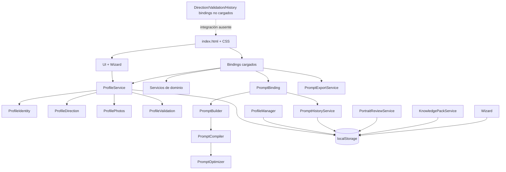
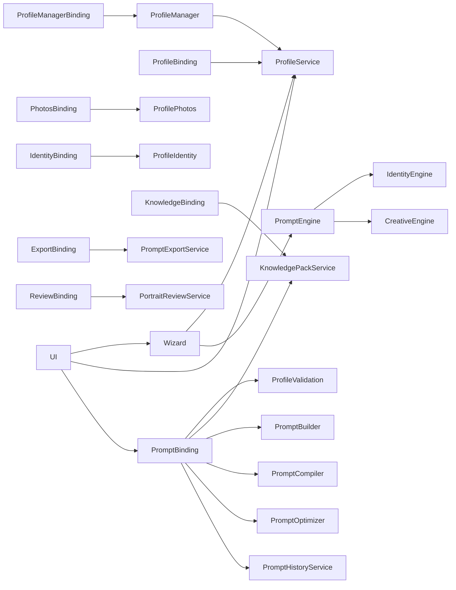
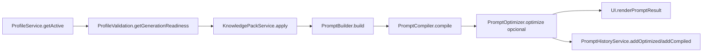
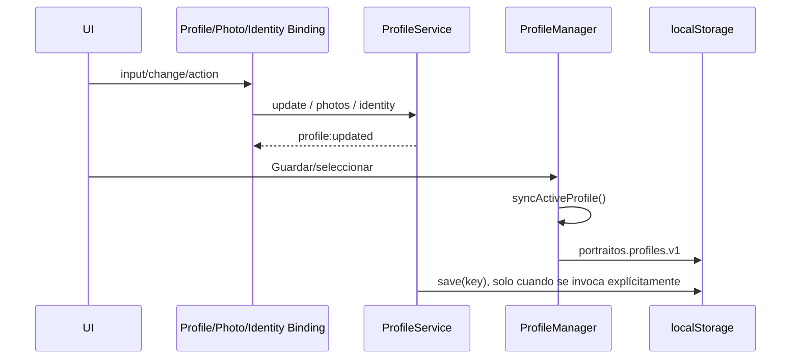
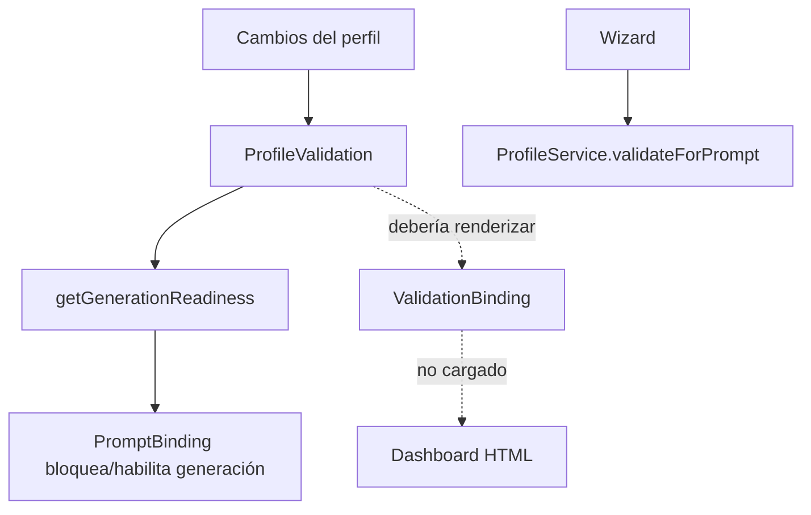
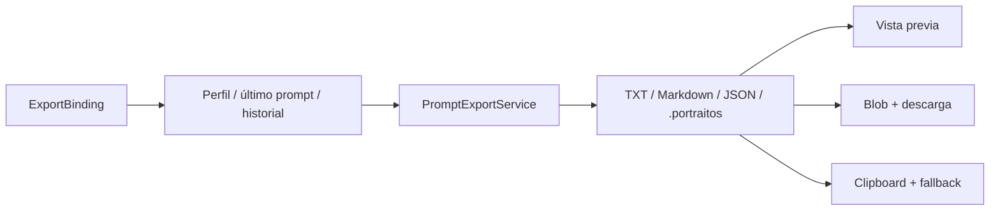

# Auditoría de reactivación de PortraitOS

Fecha: 2026-08-02  
Alcance: repositorio local en `C:\Users\seijo\Documents\GitHub\PortraitOS`  
Resultado: **AUDIT COMPLETE** (la auditoría se completó; el MVP no está operativo extremo a extremo)

## Resumen ejecutivo

PortraitOS es una aplicación web estática sin sistema de build ni dependencias declaradas. El repositorio contiene `app/index.html`, seis hojas CSS y 40 módulos JavaScript globales organizados nominalmente en bindings, servicios, motores y utilidades. Chrome carga 37 scripts y el bootstrap inicializa ocho bindings más `UI`; el arranque observado termina con `data-portraitos-ready="true"` y sin errores en stderr.

El volumen de código es sustancial, pero no equivale a integración completa. Tres bindings versionados —dirección creativa, validación e historial— no están incluidos en `index.html`. Los dos primeros son esenciales: los 22 controles `data-direction-field` quedan sin sincronización, y `data-action="validate-profile"` queda sin listener. El historial se guarda automáticamente desde `PromptBinding`, pero no tiene UI para búsqueda, favoritos, etiquetas, restauración o comparación. El router cargado conserva un modelo de seis rutas distinto del wizard visible y no es iniciado por el bootstrap.

El flujo completo solicitado no pudo declararse operativo. La aplicación arranca, crea un perfil inicial y presenta UI, pero la dirección no puede persistirse desde sus controles; por ello la validación/readiness y la generación/exportación no pueden demostrarse de extremo a extremo. La estimación conservadora del MVP es **42 %**: existen los componentes principales y parte de perfiles/fotos/identidad, pero tres de los ocho resultados imprescindibles (dirección, validación y generación/exportación encadenadas) están bloqueados o no probados.

La continuación es viable sin reescritura. Se recomienda un sprint de recuperación dedicado a convertir las integraciones existentes en un flujo ejecutable, añadir un arnés mínimo de pruebas y resolver la dualidad de navegación/persistencia mediante decisiones explícitas, sin ampliar producto.

## Estado Git inicial

| Dato | Resultado | Evidencia |
|---|---|---|
| Rama | `main` | `git branch --show-current` |
| Commit | `35f5c1d475262ae9ec6c211f2797f6af799b69ca` (`issue 4`) | `git rev-parse HEAD`; `git log` |
| Working tree | Limpio | `git status --short --branch` mostró solo `## main...origin/main` |
| Upstream | `origin/main` | `git rev-parse --abbrev-ref --symbolic-full-name '@{u}'` |
| Divergencia conocida | 0 ahead / 0 behind | `git rev-list --left-right --count HEAD...origin/main` → `0 0` |
| Remoto | `https://github.com/rubensv74/PortraitOS.git` | `git remote -v` |

La divergencia se refiere a la referencia remota local. No se ejecutó `git fetch`, por lo que no se certifica el estado actual del servidor. No había cambios locales que proteger al inicio.

## Tecnologías y configuración

- HTML5, CSS y JavaScript clásico en modo estricto; no hay framework frontend.
- Patrón IIFE con exportación global (`window.ProfileService`, `window.PromptBuilder`, etc.).
- APIs de navegador: DOM, `localStorage`, `FileReader`, Canvas, Blob/Object URL, Clipboard y Web Crypto cuando está disponible.
- No existen `package.json`, lockfile, configuración de bundler/linter, servidor, CI, pruebas ni fixtures en el commit auditado.
- `README.md` declara “0.1.0 Foundation”, mientras `app/index.html:281` muestra `PortraitOS v1.0`: versión documental y UI no coherentes.

## Punto de entrada y carga real

El punto de entrada único es `app/index.html`. Los scripts se cargan de forma síncrona al final del `body` (`app/index.html:2430-2473`) en este orden:

1. `storage.js`, `router.js`.
2. Utilidades: constants, helpers, validators y events.
3. Servicios de fotos; servicios de perfil.
4. Engines de identidad, creatividad y prompt.
5. Knowledge Pack, historial, exportación y review.
6. Bindings de knowledge, perfil, profile manager, fotos, identidad, prompt, export y review.
7. Wizard y UI.
8. Bootstrap inline en `DOMContentLoaded` (`app/index.html:2477-2515`).

Existen 40 `.js`; se cargan 37. No se cargan:

- `app/js/bindings/direction.binding.js`
- `app/js/bindings/validation.binding.js`
- `app/js/bindings/history.binding.js`

El bootstrap inicializa `KnowledgeBinding`, `ProfileManagerBinding`, `ProfileBinding`, `PhotosBinding`, `IdentityBinding`, `PromptBinding`, `ExportBinding`, `ReviewBinding` y `UI`. `UI.init()` inicia `Wizard` (`app/js/ui.js:111-131`). No hay llamada a `PortraitRouter.start()` ni a los tres bindings ausentes.

## Arquitectura real

El modelo conceptual UI → Bindings → Services → Engines → Storage solo se cumple parcialmente:

- `UI` llama directamente a `ProfileService`, `PromptBinding` y como fallback a `PromptEngine` (`app/js/ui.js:390-468`).
- `Wizard` llama directamente a `ProfileService` y `PromptEngine` (`app/js/wizard.js:660-735`).
- `PromptBinding` llama directamente a Builder → Compiler → Optimizer y al servicio de historial (`app/js/bindings/prompt.binding.js:93-188`).
- Los engines consumen el objeto perfil; no pasan por una abstracción Storage.
- Hay dos fachadas de persistencia de perfil: `PortraitStorage` (`portraitos.profile.v1`) y `ProfileManager` (`portraitos.profiles.v1`), además de claves arbitrarias en `ProfileService.save(storageKey)`.
- `PortraitRouter` es global y está cargado, pero la navegación activa se realiza con `Wizard`/`UI` y atributos `data-wizard-step`.

### Dependencias principales

No se detectó una dependencia circular de carga demostrable, pero sí acoplamiento global y rutas alternativas del pipeline, lo que permite resultados distintos entre validación del paso (`PromptEngine`) y generación UI (`PromptBinding`).

## Contratos y flujos

### Flujo real de generación

Este es el flujo del botón porque `UI.handleGenerate()` prefiere `PromptBinding.generate`. En cambio, `Wizard.validatePromptStep()` ejecuta `PromptEngine.generate(..., {strict:true})`, una ruta paralela que usa `IdentityEngine` y `CreativeEngine`. La cadena conceptual “Contract → Builder” está invertida en el código: `PromptBuilder.build()` produce el contrato.

### Persistencia del perfil

`ProfileManager.init()` crea un perfil por defecto si la biblioteca está vacía, carga el activo en `ProfileService` y persiste la biblioteca (`app/js/services/profile.manager.js:9-27`). La separación entre objeto activo y clon de biblioteca exige `syncActiveProfile()`; no todos los cambios de dominio llaman directamente a `ProfileManager.persist()`.

### Validación

Las reglas y readiness existen en servicio, y `PromptBinding` las consume. El dashboard no se activa porque `ValidationBinding` no se carga ni inicializa.

### Exportación

El servicio acepta/importa paquetes PortraitOS (`app/js/services/prompt.export.js:106-190`), pero no hay control HTML para importarlos. No se encontró checksum criptográfico del paquete.

## Inventario por responsabilidad

La matriz detallada por dominio está en `2026-08-02-portraitos-module-matrix.md`. Inventario físico completo:

| Ruta | Tipo | Responsabilidad | Cargado | Inicializado | Consumido | Estado |
|---|---|---|---:|---:|---:|---|
| `README.md` | documentación | Filosofía, arquitectura aspiracional y versión | N/A | N/A | humano | PARTIAL |
| `app/index.html` | entrada/UI | DOM, carga y bootstrap | sí | sí | navegador | PARTIAL |
| `app/css/reset.css` | CSS | normalización | sí | N/A | HTML | OPERATIONAL |
| `app/css/variables.css` | CSS | tokens | sí | N/A | CSS | OPERATIONAL |
| `app/css/layout.css` | CSS | layout base | sí | N/A | HTML | OPERATIONAL |
| `app/css/components.css` | CSS | componentes | sí | N/A | HTML | OPERATIONAL |
| `app/css/wizard.css` | CSS | wizard | sí | N/A | HTML | OPERATIONAL |
| `app/css/app.css` | CSS | estilos de módulos recientes | sí | N/A | HTML | PARTIAL |
| `app/js/storage.js` | infraestructura | perfil/settings y migración local | sí | API sin init | parcial | PARTIAL |
| `app/js/router.js` | navegación | router hash heredado | sí | no iniciado | Wizard (parcial) | IMPLEMENTED_NOT_INTEGRATED |
| `app/js/ui.js` | controlador UI | navegación, render, avisos, generación | sí | sí | bootstrap | PARTIAL |
| `app/js/wizard.js` | estado UI | pasos, guardas, progreso local | sí | vía UI | UI | PARTIAL |
| `app/js/utils/constants.js` | utilitario | constantes y claves | sí | al cargar | múltiples | OPERATIONAL |
| `app/js/utils/helpers.js` | utilitario | clones, texto, IDs, fechas | sí | al cargar | múltiples | OPERATIONAL |
| `app/js/utils/validators.js` | utilitario | validadores genéricos | sí | al cargar | múltiples | PARTIAL |
| `app/js/utils/events.js` | infraestructura | bus de eventos global | sí | al cargar | múltiples | PARTIAL |
| `app/js/services/photo.validation.js` | servicio | tipo/tamaño/resolución/colección | sí | API | Photos | PARTIAL |
| `app/js/services/photo.reader.js` | servicio | FileReader/Data URL | sí | API | ProfilePhotos | PARTIAL |
| `app/js/services/photo.thumbnail.js` | servicio | miniaturas Canvas | sí | API | ProfilePhotos | PARTIAL |
| `app/js/services/photo.metadata.js` | servicio | metadatos básicos | sí | API | ProfilePhotos | PARTIAL |
| `app/js/services/profile.photos.js` | servicio | colección, principal, orden, duplicados | sí | API | PhotosBinding/ProfileService | PARTIAL |
| `app/js/services/profile.identity.js` | servicio | modelo, validación y lock | sí | por ProfileService | IdentityBinding/engines | PARTIAL |
| `app/js/services/profile.direction.js` | servicio | modelo y reglas de dirección | sí | por ProfileService | engine/wizard | IMPLEMENTED_NOT_INTEGRATED |
| `app/js/services/profile.validation.js` | servicio | reglas, score y readiness | sí | API | PromptBinding/ProfileService | PARTIAL |
| `app/js/services/profile.importexport.js` | servicio | JSON, migración, descarga/import | sí | API | ProfileService (sin UI de import) | PARTIAL |
| `app/js/services/profile.service.js` | fachada | perfil activo y dominios | sí | por manager | casi todos | PARTIAL |
| `app/js/services/profile.manager.js` | servicio | biblioteca multi-perfil | sí | sí | binding | PARTIAL |
| `app/js/engines/identity.engine.js` | engine | contrato de identidad | sí | API | PromptEngine | PARTIAL |
| `app/js/engines/creative.engine.js` | engine | contrato creativo | sí | API | PromptEngine | PARTIAL |
| `app/js/engines/prompt.engine.js` | engine legado | prompt directo | sí | API | Wizard/fallback UI | PARTIAL |
| `app/js/engines/prompt.builder.js` | engine | Portrait Contract | sí | API | PromptBinding | PARTIAL |
| `app/js/engines/prompt.compiler.js` | engine | variantes/proveedores | sí | API | PromptBinding | PARTIAL |
| `app/js/engines/prompt.optimizer.js` | engine | optimización | sí | API | PromptBinding | PARTIAL |
| `app/js/services/knowledge.pack.service.js` | servicio | catálogo/selección/aplicación | sí | API | binding/prompt | PARTIAL |
| `app/js/services/prompt.history.js` | servicio | historial/versiones/filtros | sí | sí vía PromptBinding | prompt/export | PARTIAL |
| `app/js/services/prompt.export.js` | servicio | formatos, descarga, clipboard, import | sí | API | ExportBinding | PARTIAL |
| `app/js/services/portrait.review.js` | servicio | reviews por perfil | sí | API | ReviewBinding | PARTIAL |
| `app/js/bindings/knowledge.binding.js` | binding | catálogo y selección | sí | sí | bootstrap | PARTIAL |
| `app/js/bindings/profile.binding.js` | binding | formulario de perfil | sí | sí | bootstrap | PARTIAL |
| `app/js/bindings/profile.manager.binding.js` | binding | CRUD/selector perfiles | sí | sí | bootstrap | PARTIAL |
| `app/js/bindings/photos.binding.js` | binding | importación y galería | sí | sí | bootstrap | PARTIAL |
| `app/js/bindings/identity.binding.js` | binding | formulario y lock | sí | sí | bootstrap | PARTIAL |
| `app/js/bindings/direction.binding.js` | binding | formulario creativo/autosave | **no** | **no** | no | BROKEN |
| `app/js/bindings/validation.binding.js` | binding | dashboard/readiness | **no** | **no** | no | BROKEN |
| `app/js/bindings/prompt.binding.js` | binding | pipeline e historial automático | sí | sí | UI | PARTIAL |
| `app/js/bindings/history.binding.js` | binding | UI avanzada de historial | **no** | **no** | no; sin DOM | IMPLEMENTED_NOT_INTEGRATED |
| `app/js/bindings/export.binding.js` | binding | UI de exportación | sí | sí | bootstrap | PARTIAL |
| `app/js/bindings/review.binding.js` | binding | revisión manual | sí | sí | bootstrap | PARTIAL |

No hay configuración, scripts auxiliares, pruebas, assets, datos ni ejemplos fuera de estos archivos. No se identificaron archivos formalmente obsoletos con evidencia suficiente; `router.js` es candidato a legado, pero se clasifica no integrado.

## Validaciones técnicas ejecutadas

| Comprobación | Resultado |
|---|---|
| Sintaxis JS | 40/40 sin diagnósticos usando el runtime Electron/JS de VS Code con `--check` |
| Arranque navegador | Chrome headless exit 0; DOM con `data-portraitos-ready="true"`; stderr 0 bytes |
| Scripts | 37/40 cargados; faltan tres bindings |
| IDs HTML | 60 IDs; 0 duplicados |
| Botones | 26; todos tienen `type` |
| Formularios | 0 elementos `<form>`; la gestión depende de listeners |
| Inline handlers | 0; eventos por `addEventListener` |
| Pruebas automatizadas | inexistentes |
| Flujo E2E completo | NOT TESTED / bloqueado por integración de dirección y validación; no se declaró operativo |

### HTML, CSS y accesibilidad

- Los seis paneles visibles coinciden entre `data-wizard-step` y `data-step-panel`.
- `hidden` y `aria-hidden` se actualizan en el DOM de arranque; la primera vista queda activa.
- Todos los botones tienen tipo y no hay IDs duplicados.
- No hay `<form>`, por lo que no existe submit semántico ni fallback sin JS.
- El DOM usa progressbars y `aria-live`, pero no hay suite axe ni prueba completa de teclado; accesibilidad queda PARTIAL/NOT TESTED.
- La correspondencia exhaustiva de selectores CSS/HTML no puede certificarse sin parser CSS; se observaron estilos específicos recientes en `app.css`, pero también alta concentración y duplicidad potencial (44.645 bytes en un único archivo).

### Persistencia, seguridad y privacidad

Claves observadas:

- `portraitos.profile.v1` (`storage.js`)
- `portraitos.profiles.v1` (`profile.manager.js`)
- `portraitos.wizard` (`wizard.js` / constants)
- `portraitos.knowledge-pack.selected`
- `portraitos.knowledge-pack.by-profile.v1`
- `portraitos.reviews.v1`
- clave de historial definida en `prompt.history.js`
- claves de settings/theme/sidebar en `storage.js`/constants

Fotos de referencia y reviews se convierten a Data URL (`profile.photos.js:62-126`, `review.binding.js:38-51`) y terminan en objetos guardables en `localStorage`. No hay gestión global de cuota ni almacenamiento binario; solo el servicio de review convierte el fallo de guardado en mensaje explícito. Esto expone datos biométricos en almacenamiento local en claro y facilita exceder el límite típico del navegador. Las exportaciones pueden incluir perfil, contrato, historial y fotos según la fuente, por lo que contienen datos personales.

Se usa `innerHTML` en varios bindings. Profile Manager, Knowledge y Review escapan valores antes de interpolarlos; los renderizadores grandes deben revisarse caso a caso. Importación valida estructura/versiones, y nombres de exportación se sanea en `PromptExportService.sanitizeFileName()` (`prompt.export.js:365-415`). No hay Content Security Policy ni checksum del paquete PortraitOS.

## Evaluación por dominio

- **Profile Manager:** CRUD, activo y biblioteca persisten; exportar existe. Importar no está expuesto en UI. El aislamiento depende de sincronizar el clon activo antes de seleccionar/guardar.
- **Photos:** import, drag/drop, lectura, thumbnails, metadatos, principal, orden, eliminación y duplicados están codificados. Data URL en `localStorage` es un riesgo. No se ejecutó con fixture real.
- **Identity:** formulario, validación, lock/unlock y persistencia están conectados; engines la consumen. No se completó E2E por falta de fotografía/datos de prueba.
- **Creative Direction:** servicio y engine existen; el binding completo no se carga. Los controles HTML no escriben al perfil. BROKEN.
- **Knowledge Packs:** catálogo integrado, selección global y por perfil, aplicación previa al Builder. Catálogo embebido; compatibilidad limitada a reglas internas.
- **Validation:** servicio y readiness son consumidos por PromptBinding; dashboard/botón están rotos por binding ausente. Hay dos validaciones (Wizard/servicio y ValidationBinding) con riesgo de divergencia.
- **Prompt Pipeline:** Builder → Compiler → Optimizer → History está integrado en `PromptBinding`; `PromptEngine` permanece como ruta paralela. Bloqueado funcionalmente por dirección/readiness.
- **History:** guardado automático existe. UI avanzada no cargada y no existe su DOM; búsqueda, favoritos, restauración y comparación no son accesibles.
- **Export:** TXT/Markdown/JSON/PortraitOS, preview, descarga y clipboard están conectados. La importación posterior existe solo en API, no en UI; no hay checksum.
- **Portrait Review:** carga, checklist, estado, notas, historial y asociación por perfil funcionan en código y binding. Es revisión manual, no análisis automático. Persiste la imagen completa como Data URL.
- **Router/Wizard/UI:** Wizard visible arranca; Router no se inicia y sus rutas no coinciden. No se completó navegación manual interactiva; arranque y primer render sí se verificaron.

## Riesgos y alternativas arquitectónicas

1. **Dos pipelines de prompt.** Impacto: validación y resultado pueden discrepar. Alternativas: (a) hacer que Wizard use `PromptBinding.preview`; (b) encapsular Builder/Compiler dentro de `PromptEngine`; (c) retirar una ruta tras migración. Recomendación: una fachada única de aplicación alrededor de `PromptBinding`, manteniendo engines puros.
2. **Dos modelos de navegación.** Impacto: hash, paso y panel pueden divergir. Alternativas: (a) adaptar Router a los seis IDs actuales; (b) eliminar Router; (c) hacer Wizard adaptador del Router. Recomendación: conservar Wizard como estado y adaptar Router como sincronizador de URL, previa prueba.
3. **Persistencia fragmentada.** Impacto: copias divergentes y pérdida al cambiar perfil. Alternativas: (a) ProfileManager como repositorio único; (b) PortraitStorage como repositorio y Manager como índice; (c) almacenamiento por perfil. Recomendación: definir primero un contrato/repositorio único y migración explícita.
4. **Globals y orden de scripts.** Impacto: fallos tardíos y difícil testabilidad. Alternativas: mantener globals con registro de dependencias; módulos ES nativos; bundler. Para MVP, recomendación mínima: conservar arquitectura y añadir smoke/integration tests antes de una migración post-MVP.

No se implementó ninguna alternativa durante esta auditoría.

## Recomendación de continuación

Continuar, pero no añadir funcionalidades. El siguiente sprint debe recuperar el flujo actual: cargar/inicializar Direction y Validation, decidir la ruta única del prompt, comprobar sincronización por perfil y crear pruebas de humo/E2E del recorrido mínimo. History UI, importación gráfica avanzada y Portrait Review pueden quedar fuera del MVP inicial. Los hallazgos y criterios exactos están en los documentos de findings, backlog y roadmap.
