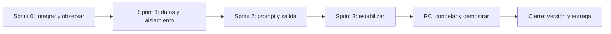

# Roadmap de cierre del MVP de PortraitOS

Fecha: 2026-08-02  
Horizonte: 1 sprint de recuperación, 3 de implementación, 1 RC y 1 de cierre.

## Estado estimado del MVP

**42 % completado.** No es una medida por líneas ni archivos. Se ponderan ocho resultados mínimos: perfil, fotos, identidad, dirección, validación, prompt, copia/export y recuperación tras recarga. Perfil arranca y su CRUD está conectado; fotos e identidad tienen integración sustancial pero no prueba E2E; dirección y dashboard de validación están confirmados rotos; prompt/export existen pero quedan aguas abajo de esos blockers; recuperación está fragmentada y no verificada. La base técnica reduce el trabajo restante, pero no permite elevar la cifra sin evidencia funcional.

## Definición de MVP

PortraitOS MVP es una aplicación local que permite construir y conservar un único flujo de Portrait Contract por perfil:

`Crear/seleccionar perfil → importar referencias → definir y bloquear identidad → definir dirección creativa → validar readiness → generar prompt → copiar/exportar → recargar y continuar sin pérdida`.

### Obligatorio

- Perfiles aislados y persistentes.
- Una o más fotos válidas, con principal.
- Identidad editable, validable y bloqueable.
- Dirección creativa editable/persistente.
- Un contrato de validación/readiness.
- Un pipeline canónico de prompt.
- Copia y al menos un formato de exportación portable.
- Recuperación tras recarga.
- Errores visibles y E2E reproducible.

### Aplazable

- Importación UI de backups/paquetes.
- History Studio completo.
- Checksum de paquete.
- Responsive/accesibilidad exhaustivos, manteniendo un mínimo RC.
- Portrait Review avanzado.

### Post-MVP

- Análisis automático de imagen.
- Catálogo/editor externo de Knowledge Packs.
- Migración arquitectónica a módulos/bundler.
- Almacenamiento de imágenes rediseñado más allá de mitigaciones MVP.

## Roadmap

### Sprint 0 — Recuperación verificable

- **Objetivo único:** convertir el código existente en un flujo integrable y observable, sin ampliar producto.
- **Issues:** P0-01, P0-02, P0-03 y base de P0-04.
- **Archivos probables:** `app/index.html`, `direction.binding.js`, `validation.binding.js`, `wizard.js`, `ui.js`, `prompt.binding.js`, `profile.validation.js`, nueva infraestructura mínima de test aprobada.
- **Dependencias:** ninguna externa salvo elegir runtime de pruebas; conservar contratos existentes.
- **Criterios de salida:** Direction y Validation cargan una sola vez; un perfil fixture alcanza/no alcanza readiness de forma determinista; Wizard y Generate usan la misma fachada; smoke automático arranca sin consola/404.
- **Riesgos:** listeners duplicados y diferencias ocultas entre reglas/pipelines.

### Sprint 1 — Datos del Portrait Contract

- **Objetivo único:** garantizar que perfil, fotos, identidad y dirección son correctos y aislados.
- **Issues:** P1-01, P1-02, P1-03.
- **Archivos probables:** `profile.manager.js`, `profile.service.js`, `storage.js`, servicios/bindings de fotos, `profile.identity.js`, `identity.binding.js`, `profile.direction.js`.
- **Dependencias:** Sprint 0 verde.
- **Criterios de salida:** crear dos perfiles, importar fixture, principal/orden, completar y bloquear identidad, editar dirección, cambiar entre perfiles y recargar sin cruce ni pérdida; cuota/corrupción fallan de forma visible y no destructiva.
- **Riesgos:** formatos locales históricos y límite variable de localStorage.

### Sprint 2 — Prompt y salida mínima

- **Objetivo único:** producir, guardar y exportar un resultado canónico.
- **Issues:** P1-04, P1-05, P1-06.
- **Archivos probables:** Knowledge Pack service/binding, PromptBinding, Builder/Compiler/Optimizer (solo fixes confirmados), PromptHistoryService, PromptExportService/Binding, UI.
- **Dependencias:** Portrait Contract persistente del Sprint 1.
- **Criterios de salida:** pack seleccionado modifica solo dirección permitida; un prompt se genera una vez, crea una versión, preview/copy/download coinciden y el último resultado reaparece tras recarga por perfil.
- **Riesgos:** contratos de salida diferentes y datos sensibles en export.

### Sprint 3 — Estabilización MVP

- **Objetivo único:** eliminar fallos de recuperación y navegación antes de RC.
- **Issues:** P2-01, P2-02, P2-03 y mínimo de P2-04.
- **Archivos probables:** servicios persistentes, router/wizard/UI, bindings con `innerHTML`, import/export, HTML/CSS.
- **Dependencias:** E2E funcional del Sprint 2.
- **Criterios de salida:** almacenamiento corrupto no rompe ni borra silenciosamente; navegación canónica; payloads hostiles básicos escapados; flujo por teclado y viewport objetivo sin blocker.
- **Riesgos:** resolver Router puede ampliar regresión; CSP completa puede requerir retirar script inline y queda fuera si no se aprueba.

### Sprint RC — Release candidate

- **Objetivo único:** congelar alcance y demostrar el MVP en entorno limpio.
- **Issues:** bugs BLOCKER/CRITICAL/HIGH reproducibles surgidos del E2E; P2-05.
- **Archivos probables:** solo los vinculados a defectos confirmados, README/versionado y tests.
- **Dependencias:** Sprints 0-3 cerrados.
- **Criterios de salida:** instalación limpia; suite verde; consola sin excepciones/404; round trip de recarga; matriz de aceptación firmada; cero BLOCKER/CRITICAL abiertos y HIGH con decisión explícita.
- **Riesgos:** introducir alcance nuevo bajo etiqueta de bug.

### Sprint de cierre — MVP 1.0

- **Objetivo único:** publicar una línea base reproducible y transferible.
- **Issues:** documentación final, versión, notas de limitaciones, verificación final y tag/release tras aprobación.
- **Archivos probables:** README, documentos de release/versionado, configuración de tests; fixes solo si bloquean criterios.
- **Dependencias:** RC aceptada.
- **Criterios de salida:** versión única, instrucciones de arranque/test, backup/privacidad/limitaciones documentadas, tag y artefacto local reproducibles.
- **Riesgos:** discrepancia de versión 0.1.0/v1.0 y decisión tardía sobre formato de distribución.

## Diagrama de secuencia de entrega

## Orden técnico recomendado

1. No tocar arquitectura hasta tener smoke y evidencia de integración.
2. Integrar DirectionBinding y ValidationBinding existentes.
3. Unificar la fachada de validación/generación.
4. Demostrar el flujo en un perfil fixture.
5. Garantizar fuente de persistencia y aislamiento multi-perfil.
6. Cerrar fotos/identidad/dirección.
7. Cerrar Knowledge → Prompt → History → Export.
8. Resolver recuperación, navegación y seguridad básica.
9. Congelar alcance en RC.

## Propuesta exacta del siguiente sprint

### Nombre

**Sprint 0 — Recuperación verificable del flujo Portrait Contract**

### Objetivo

Hacer que la dirección creativa y la validación existentes sean accesibles y que toda comprobación/generación utilice una única ruta observable, protegida por un smoke test.

### Alcance

- Cargar e inicializar `DirectionBinding` y `ValidationBinding` una sola vez.
- Verificar dependencia/orden de scripts y todos los selectors existentes.
- Definir un DTO único de `ProfileValidation` para dashboard y readiness.
- Alinear `Wizard.validatePromptStep()` con la fachada canónica elegida (`PromptBinding` recomendado).
- Añadir servidor/runner mínimo y dos escenarios: perfil inválido y perfil válido fixture.
- Registrar consola, recursos 404, estado de botones, eventos y número de entradas de historial.

### Fuera de alcance

- History Studio completo.
- Importación UI.
- Nuevos campos/reglas/proveedores/presets.
- Refactor de globals, módulos ES, framework o cambio de storage.
- Mejoras de Portrait Review.

### Archivos probables

- `app/index.html`
- `app/js/bindings/direction.binding.js`
- `app/js/bindings/validation.binding.js`
- `app/js/services/profile.validation.js`
- `app/js/bindings/prompt.binding.js`
- `app/js/wizard.js`
- `app/js/ui.js`
- nuevos archivos mínimos de test/configuración, sujetos a aprobación de dependencia/herramienta

### Criterios de aceptación

1. Los 40 scripts siguen pasando sintaxis y la aplicación arranca sin error/404.
2. DirectionBinding reporta 22 campos y cada cambio actualiza el perfil activo.
3. ValidationBinding renderiza el DTO del servicio; un blocker deshabilita Generate.
4. Wizard, dashboard y Generate coinciden para fixtures válido/inválido.
5. Una acción de Generate provoca una generación y, si procede, una única versión de historial.
6. Cambiar perfil y recargar conserva dirección/readiness sin contaminación cruzada.
7. El smoke/E2E se ejecuta con un único comando documentado.

### Riesgos y mitigación

- **Doble listener de Generate:** aserción de conteo y revisión de ownership UI/ValidationBinding.
- **Defaults aparentan persistencia:** fixture cambia valores respecto a defaults y recarga.
- **Reglas divergentes:** snapshots del DTO y códigos de error, no comparación de textos solamente.
- **Tooling nuevo:** elegir la opción mínima y solicitar aprobación antes de dependencia.

## Criterios globales de salida del MVP

- Cero BLOCKER y CRITICAL abiertos.
- HIGH relacionados con flujo/persistencia/export resueltos o excluidos de producto de forma explícita.
- E2E limpio del recorrido completo y recarga en dos perfiles.
- Ninguna excepción de consola ni recurso local 404.
- Datos inválidos/corruptos producen errores visibles sin pérdida silenciosa.
- Copia/export representa exactamente el resultado generado.
- README y versión describen el producto real y sus limitaciones de privacidad/cuota.

## Decisiones que requieren aprobación antes de implementación

1. Fachada canónica: recomendada `PromptBinding`; alternativa encapsular todo bajo `PromptEngine`.
2. Navegación: adaptar Router al Wizard (recomendada) o retirar Router.
3. Persistencia canónica: ProfileManager como repositorio (recomendada para MVP) o PortraitStorage como base.
4. Runtime/herramienta mínima de pruebas y cualquier dependencia nueva.
5. Mitigación MVP de imágenes frente a migración post-MVP a IndexedDB.

Ninguna de estas decisiones arquitectónicas fue implementada en la auditoría.
